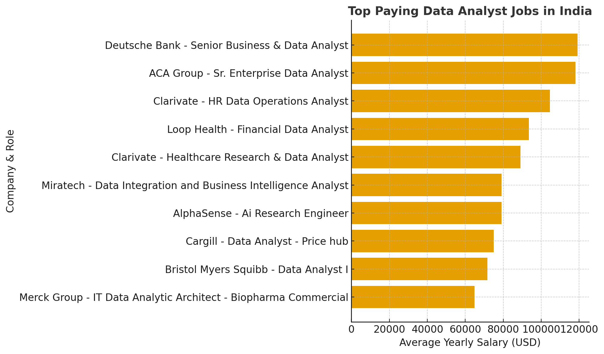

# SQL_Project_Data_Job_Analysis

## Introduction

📊 Dive into the Indian data job market! This project focuses on Data Analyst roles in India, uncovering insights into 💰 top-paying positions, 🔥 most in-demand skills, and 📈 the sweet spot where high demand meets high salary in the world of data analytics.

🔍 Explore the full set of SQL queries in the [project_sql](Project_sql) to see how each analysis was performed. 

## 📚 Background  

Driven by the goal of understanding and navigating the **Data Analyst job market in India** more effectively, this project was created to uncover insights about the skills and roles that truly matter.  

The motivation behind this analysis was to identify **top-paying** and **in-demand** skills, helping aspiring data analysts streamline their career planning and focus on what brings the best opportunities.  

---
### 💡 Key Questions Explored  

1. 💰 What are the **top-paying Data Analyst jobs** in India?  
2. 🧩 What **skills are required** for these top-paying jobs?  
3. 🔥 What **skills are most in demand** for data analysts?  
4. 📈 Which **skills are associated with higher salaries**?  
5. 🎯 What are the **most optimal skills** to learn — combining both demand and pay potential?

## 🛠️ Tools I Used  

For my deep dive into the **Data Analyst job market in India**, I utilized several key tools that powered my analysis and workflow:  

- **🧮 SQL:** The backbone of my analysis — used to query datasets and uncover actionable insights.  
- **🐘 PostgreSQL:** My chosen database management system, perfect for managing and analyzing large volumes of job posting data.  
- **💻 Visual Studio Code:** My go-to environment for writing, running, and managing SQL queries efficiently.  
- **🌐 Git & GitHub:** Essential for version control, tracking progress, and sharing my SQL scripts and findings for collaboration and transparency.


## 📊 The Analysis  

Each SQL query in this project was designed to explore a specific aspect of the **Data Analyst job market in India**.  
Below is a breakdown of how each question was approached and analyzed:  

---

### 1️⃣ Top-Paying Data Analyst Jobs  
To identify the **highest-paying roles**, I filtered job postings by:  
- **Job title:** Data Analyst  
- **Location:** India (focusing on both on-site and remote roles)  
- **Salary:** Considered only those with available yearly salary data  

This analysis revealed which companies and positions offer the **best salary potential** in the Indian data analytics market.  


**📄 SQL Query**
```sql
/*
Question → What are the highest-paying data analyst jobs in India?
Goal → Identify the top 10 data analyst roles with the highest salary potential.
*/

SELECT 
    job_id,
    name AS company_name,
    job_title,
    job_location,
    job_schedule_type,
    salary_year_avg,
    job_posted_date::date AS Date
FROM 
    job_postings_fact
LEFT JOIN company_dim 
    ON job_postings_fact.company_id = company_dim.company_id
WHERE
    job_title_short = 'Data Analyst'
    AND job_location = 'India'
    AND salary_year_avg IS NOT NULL
ORDER BY
    salary_year_avg DESC
LIMIT 10;
```

#### 📈 Chart Story Breakdown  

This chart visualizes the **Top 10 Highest-Paying Data Analyst Jobs in India**, comparing average yearly salaries across companies and job titles.

- **🏦 Deutsche Bank** leads with the **Senior Business & Data Analyst** role, offering an average salary of around **$119K**, showing strong demand for senior data professionals in the finance sector.
  
- **🏢 ACA Group** follows closely with a **Sr. Enterprise Data Analyst** position paying around **$118K**, indicating high value for enterprise-level data analytics.
  
- **🧬 Clarivate** appears twice in the list, reflecting consistent investment in data-driven roles within research and healthcare domains.
  
- **💡 Loop Health** and **Cargill** highlight how data analytics extends beyond tech — into **healthcare** and **supply chain analytics** with competitive pay.
  
- **📊 AlphaSense** and **Miratech** offer strong salaries for roles blending **AI research, business intelligence, and data integration**, underscoring the growing overlap between analytics and automation.
  
- **🔬 Merck Group** and **Bristol Myers Squibb** show that **biopharma companies** also value analytical expertise for research and commercial operations.  

**🧩 Key Takeaway:**  
High-paying Data Analyst roles in India are concentrated in **finance, enterprise solutions, and research-based industries**, especially for **senior o**





